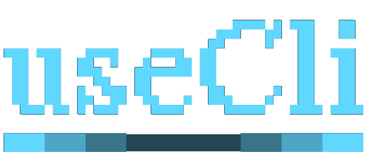

<a name="readme-top"></a>

<!-- PROJECT LOGO -->
<div align="center">
  <a href="https://github.com/thememium/usecli">
    
  </a>

  <!-- <h3 align="center">useCli</h3> -->

  <p align="center">
    <a href="#table-of-contents"><strong>Explore the Documentation »</strong></a>
    <br />
    <a href="https://github.com/thememium/usecli/issues">Report Bug</a>
    ·
    <a href="https://github.com/thememium/usecli/issues">Request Feature</a>
  </p>
</div>

<!-- TABLE OF CONTENTS -->

<a name="table-of-contents"></a>

<details>
  <summary>Table of Contents</summary>
  <ol>
    <li>
      <a href="#about-the-project">About The Project</a>
      <ul>
        <li><a href="#key-features">Key Features</a></li>
        <li><a href="#built-with">Built With</a></li>
      </ul>
    </li>
    <li>
      <a href="#getting-started">Getting Started</a>
      <ul>
        <li><a href="#prerequisites">Prerequisites</a></li>
        <li><a href="#installation">Installation</a></li>
      </ul>
    </li>
    <li>
      <a href="#usage">Usage</a>
      <ul>
        <li><a href="#create-your-own-cli">Create Your Own CLI</a></li>
        <li><a href="#available-commands">Available Commands</a></li>
        <li><a href="#prefix-matching">Prefix Matching</a></li>
        <li><a href="#interactive-mode">Interactive Mode</a></li>
      </ul>
    </li>
    <li>
      <a href="#development">Development</a>
      <ul>
        <li><a href="#poe-tasks">Poe Tasks</a></li>
        <li><a href="#testing">Testing</a></li>
        <li><a href="#code-quality">Code Quality</a></li>
        <li><a href="#architecture">Architecture</a></li>
      </ul>
    </li>
    <li><a href="#contributing">Contributing</a></li>
    <li><a href="#license">License</a></li>
  </ol>
</details>

<!-- ABOUT THE PROJECT -->

## About The Project

useCli is an elegant CLI framework for Python. It provides a beautiful, interactive command-line interface with rich styling, command scaffolding, and intuitive prefix matching for quick command execution.

### Key Features

- **Prefix Matching**: Type partial command names and let useCli find the right command for you
- **Rich UI**: Beautiful terminal output with Rich console integration and semantic color system
- **Command Scaffolding**: Generate new commands instantly with `make:command`
- **Modular Architecture**: Separate default commands from custom commands
- **Interactive Menus**: Built-in terminal menu utilities for enhanced user experience
- **Error Handling**: Styled error messages with custom exception classes
- **Type Safety**: Full type hints throughout the codebase

### Built With

- **Typer**: Modern CLI framework for building command-line interfaces
- **Click**: Python package for creating beautiful command-line interfaces
- **Rich**: Library for rich text and beautiful formatting in the terminal
- **simple-term-menu**: Interactive terminal menus

<p align="right">(<a href="#readme-top">back to top</a>)</p>

<!-- GETTING STARTED -->

## Getting Started

### Prerequisites

- Python 3.10 or higher
- [uv](https://github.com/astral-sh/uv) (recommended) or pip

### Installation

#### Add as a Dependency

To add usecli to your project's dependencies:

```sh
uv add "usecli @ git+https://github.com/thememium/usecli.git"
```

Or with pip:

```sh
pip install git+https://github.com/thememium/usecli.git
```


<p align="right">(<a href="#readme-top">back to top</a>)</p>

<!-- USAGE -->

## Usage

### Create Your Own CLI

Initialize a new CLI in your project:

```sh
usecli init
```

This prompts for your CLI title, description, commands directory, and entry point name. It creates the commands package, writes a useCli config (`[tool.usecli]` in `pyproject.toml` or `usecli.config.toml`), and ensures a `[project.scripts]` entry points to `usecli:run_app`.

After init, run your CLI (default command name is `usecli`) and scaffold commands:

```sh
usecli make:command mycommand
```

### Available Commands

```
┌─────────────────────────────────────────────────────────────────────────────┐
│                        COMMANDS                                             │
├─────────────────────────────────────────────────────────────────────────────┤
│  Core Commands:                                                             │
│    about              Display detailed information about the application    │
│    help               Show help information                                 │
│    init               Initialize usecli in the current project              │
│    inspire            Display an inspirational quote                        │
│                                                                             │
│  Development:                                                               │
│    make:command       Create a new CLI command                              │
└─────────────────────────────────────────────────────────────────────────────┘
```

### Prefix Matching

useCli supports prefix matching, allowing you to type partial command names:

```sh
# These all work:
usecli he          # Runs 'help'
usecli ab          # Runs 'about'  
usecli ma:co       # Runs 'make:command'
```

If your prefix matches multiple commands, useCli will display a filtered list for you to choose from.

### Interactive Mode

Every command supports an `--interactive` (or `-i`) option. This opens the interactive command runner instead of executing the command directly.

```sh
usecli --interactive
usecli help --interactive
usecli make:command --interactive
```

### Creating New Commands

Generate a new command scaffold:

```sh
usecli make:command mycommand
```

This creates a new command file in the custom commands directory with a complete boilerplate:

```python
from usecli import Argument, BaseCommand, Option, Prompt, console


class MycommandCommand(BaseCommand):
    def signature(self) -> str:
        return "mycommand"

    def description(self) -> str:
        return "Description of mycommand"

    def handle(
        self,
        name: str = Argument(..., help="Your name"),
        greeting: str = Option("Hello", "--greeting", "-g", help="Greeting to use"),
    ) -> None:
        console.print(f"[bold green]{greeting}, {name}![/bold green]")

        favorite = Prompt.ask(
            "What's your favorite color?",
            choices=["red", "green", "blue"],
        )
        console.print(f"You chose: {favorite}")
```

<p align="right">(<a href="#readme-top">back to top</a>)</p>

<!-- DEVELOPMENT -->

## Development

### Poe Tasks

This project uses `poe` for task management. Available tasks:

| Task | Description |
|------|-------------|
| `uv run poe dev` | Run the CLI application |
| `uv run poe clean` | Run isort and ruff format |
| `uv run poe clean-full` | Run isort, ruff check/fix, ruff format, deptry, and ty check |
| `uv run poe sort` | Run isort |
| `uv run poe lint` | Run ruff linter with auto-fix |
| `uv run poe format` | Run ruff formatter |
| `uv run poe test` | Run pytest test suite |
| `uv run poe deptry` | Check for dependency issues |
| `uv run poe typecheck` | Run ty type checker |

### Testing

Run the test suite:

```sh
uv run poe test
```

Or with verbose output:

```sh
uv run pytest tests/ -v
```

### Code Quality

Format and lint code:

```sh
uv run poe clean-full
```

Individual tools:

```sh
# Sort imports
uv run poe sort

# Lint code
uv run poe lint

# Format code
uv run poe format

# Type check
uv run poe typecheck

# Check dependencies
uv run poe deptry
```

### Architecture

This section is for contributors or those extending useCli.

#### Core Components

- **BaseCommand**: Abstract base class that all commands must inherit from
- **CommandService**: Dynamically discovers and loads commands from directories
- **PrefixMatchingGroup**: Custom Typer group enabling prefix matching functionality
- **COLOR**: Semantic color system for consistent UI styling

#### Command Structure

All commands follow a consistent structure:

```python
class MyCommand(BaseCommand):
    def signature(self) -> str:
        """Return the command name (e.g., 'make:command')."""
        return "my:command"

    def description(self) -> str:
        """Return a sh/Users/edwardboswell/ghq/github.com/thememium/usespec/README.mds command does"

    def handle(self, *args, **kwargs) -> None:
        """Execute the command logic."""
        pass
```

#### Directory Layout

**Source Code Structure:**

```
src/usecli/
├── __init__.py                    # Main entry point
├── cli/
│   ├── commands/                  # Command implementations
│   │   ├── defaults/             # Built-in commands
│   │   │   ├── base/             # Core commands (about, help, inspire)
│   │   │   ├── core/             # Utility commands
│   │   │   └── make/             # Code generation commands
│   │   └── custom/               # User-defined commands
│   ├── config/                   # Color system and configuration
│   ├── core/                     # BaseCommand, error handling, validators
│   ├── services/                 # Command loading service
│   ├── templates/                # Jinja2 templates for scaffolding
│   └── utils/                    # Interactive utilities
└── shared/                       # Global configuration
```

<p align="right">(<a href="#readme-top">back to top</a>)</p>

<!-- CONTRIBUTING -->

## Contributing

Contributions are welcome! Please read the [Contributing Guide](.github/contributing.md) for detailed information on:

- Development setup
- Code quality requirements
- Pull request expectations
- Style guidelines

Quick start:

1. Fork the repository
2. Create your feature branch (`git checkout -b feature/AmazingFeature`)
3. Make your changes
4. Run tests and ensure code quality (`uv run poe clean-full`)
5. Commit your changes (`git commit -m 'Add some AmazingFeature'`)
6. Push to the branch (`git push origin feature/AmazingFeature`)
7. Open a Pull Request

<p align="right">(<a href="#readme-top">back to top</a>)</p>

<!-- LICENSE -->

## License

Distributed under the MIT License. See `LICENSE` for more information.

<p align="right">(<a href="#readme-top">back to top</a>)</p>

---

<div align="center">
  <p>
    <sub>Built with ❤️ by <a href="https://github.com/thememium">thememium</a></sub>
  </p>
</div>
